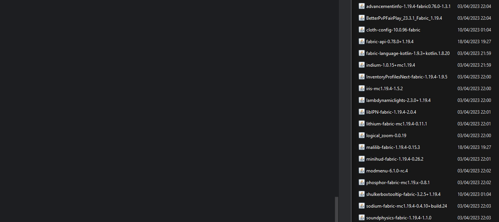

# mc-mods-checker

Updates your local Minecraft mods.



## Features

- Scan your mods folder and find the matching CurseForge page for each mod
- Check for mod updates for your current Minecraft version
- Update your mods to the latest Minecraft version if any is available
- Move your old mods to a backup folder (switching to a newer Minecraft version) or send them to the trash

## Planned improvements

- Add support for other modding platforms
  - [x] CurseForge
  - [ ] Modrinth (as soon as we're able to download files from their API)
- Add GitHub Actions pipeline for releases?

## Configuration

You need a CurseForge API key to use this script. You can get one [here](https://console.curseforge.com/#/api-keys). Simply create an account, give your organization a name and copy the key alongside the script in a file named `.env`.

```
# mc-mods-checker/.env
CURSEFORGE_API_KEY=your_key_here
```

## Usage

```shell
$ git clone https://github.com/WarningImHack3r/mc-mods-checker
$ cd mc-mods-checker
$ pip install -r requirements.txt
$ python3 mods_checker.py  # Requires Python 3.11+
```
